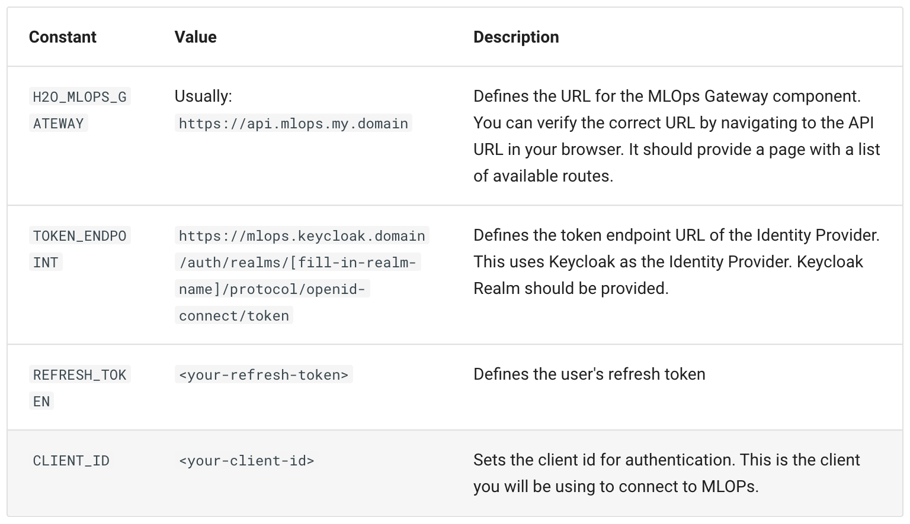
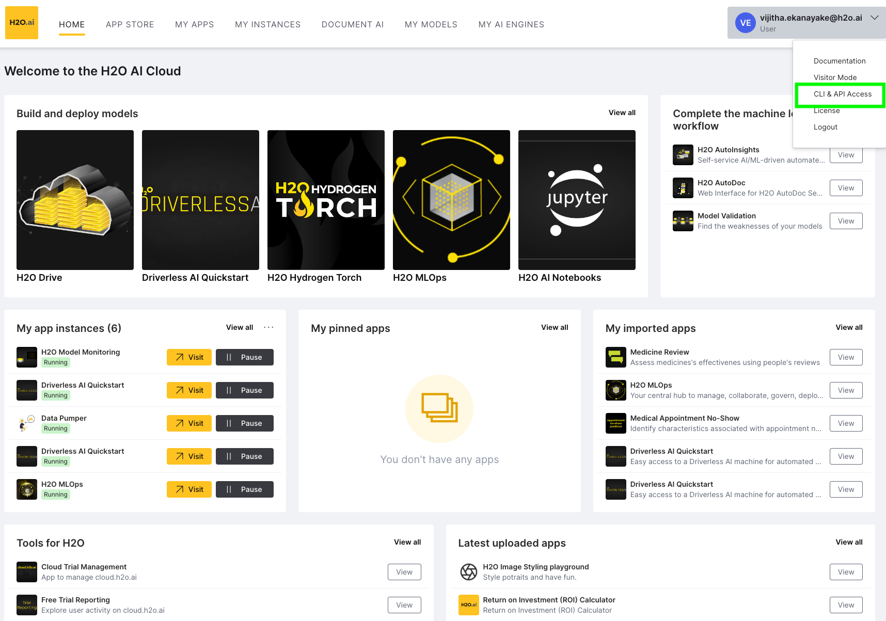
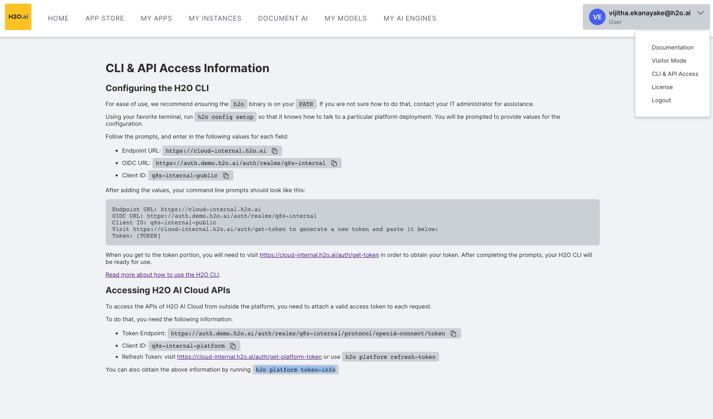

# Making Predictions using MLOps Python client

Following is the sample implementation you can use to make predictions against MLOps deployment in the H2O.ai hybrid cloud.

You will need the values for the following constants in order to connect successfully to MLOPs. 


 

You can obtain the above information from the following methods If not contact your administrator to obtain deployment-specific values.

To find out the specific values to enter for these fields according to your environment, you can click on your username on the top-right corner of the App Store home screen, and click <b>CLI & API Access</b>.

 

You will see the following screen with the generated values for Token Endpoint, Client ID, and link to obtain platform refresh token under Accessing H2O AI Cloud APIs section.

MLOps Gateway URL probably will  be <PROTOCOL>://mlops-api.<APPSTORE_DOMAIN> e.g https://mlops-api.example.comi/. If not you can request it from your cloud administrator. 

 

## Setting up environment 

Verify you have python 3.7 or a later version installed in your environment.
```shell
python --version
```

Clone this repository. Navigate to <b>mlops_scoring</b> directory from the terminal. Then run the following commands to create a virtual environment and install needed dependencies.
```bash
python3 -m venv venv
source venv/bin/activate
./venv/bin/python3 -m pip install --upgrade pip
./venv/bin/pip3 install -r requirements.txt
```

Provide the path to scoring data CSV. If you can create a data frame from any other mechanism would also be fine too.
```python
# Create Panda data frame from scoring data csv
df = pd.read_csv("<SCORING_DATA_CSV>")
```

Update the values in the python script(mlops_predictions.py) in relevant placeholders to initialize the token provider, client and deployment id.

```python
# Create Token Provider
mlops_token_provider = mlops.TokenProvider(
 refresh_token="<REFRESH_TOKEN>",
 client_id="<CLIENT_ID>",
 token_endpoint_url="<TOKEN_ENDPOINT_URL>"
)
```

```python
# Setting up MLOPS client.
mlops_client = mlops.Client(
 gateway_url="<H2O_MLOPS_GATEWAY>",
 token_provider=mlops_token_provider
)
```

#### Get the deployment status by deployment Id
```python
deployment_status = mlops_client.deployer.deployment_status.get_deployment_status({
 'deployment_id': "<DEPLOYMENT_ID>"
}).deployment_status
```

After updating above values run the script with below command to make the predictions.

```python
./venv/bin/python3 mlops_predictions.py
```

You can verify whether scoring is successful from the admin analytics application under the associated experiment.
 

At this point, you should be able to create drift reports from the Model Monitoring application if there are more than 100 scoring records.

Note: In the script, scoring data frame is generated parsing CSV file. If you can create a data frame from any other mechanism would be fine too.